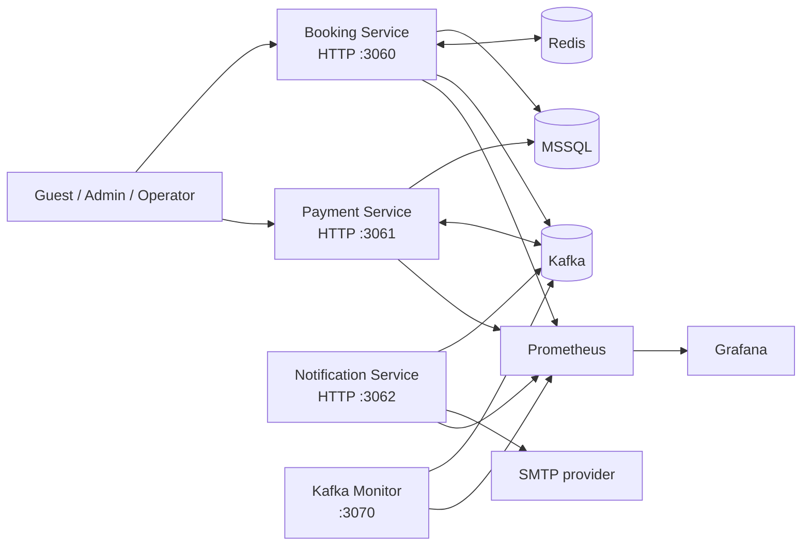
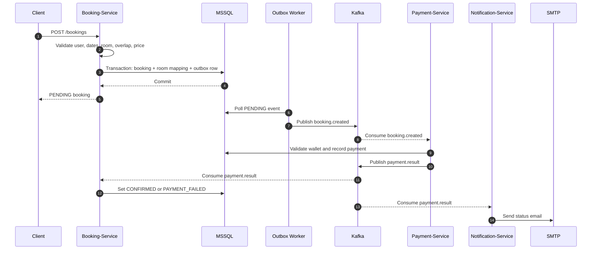
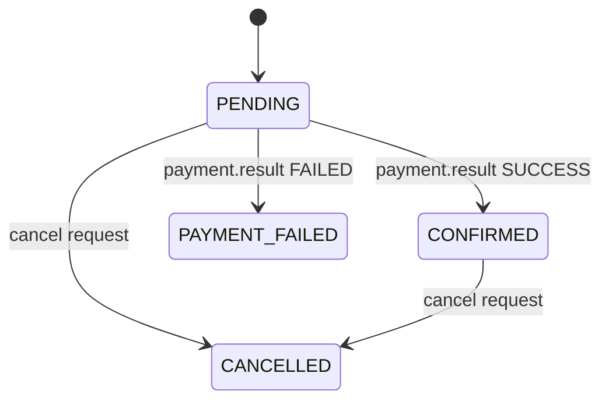
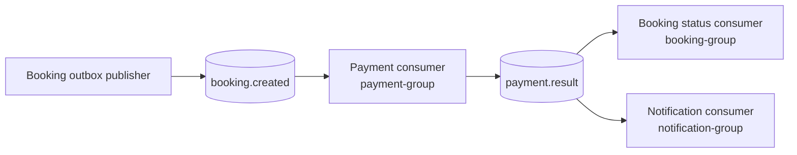
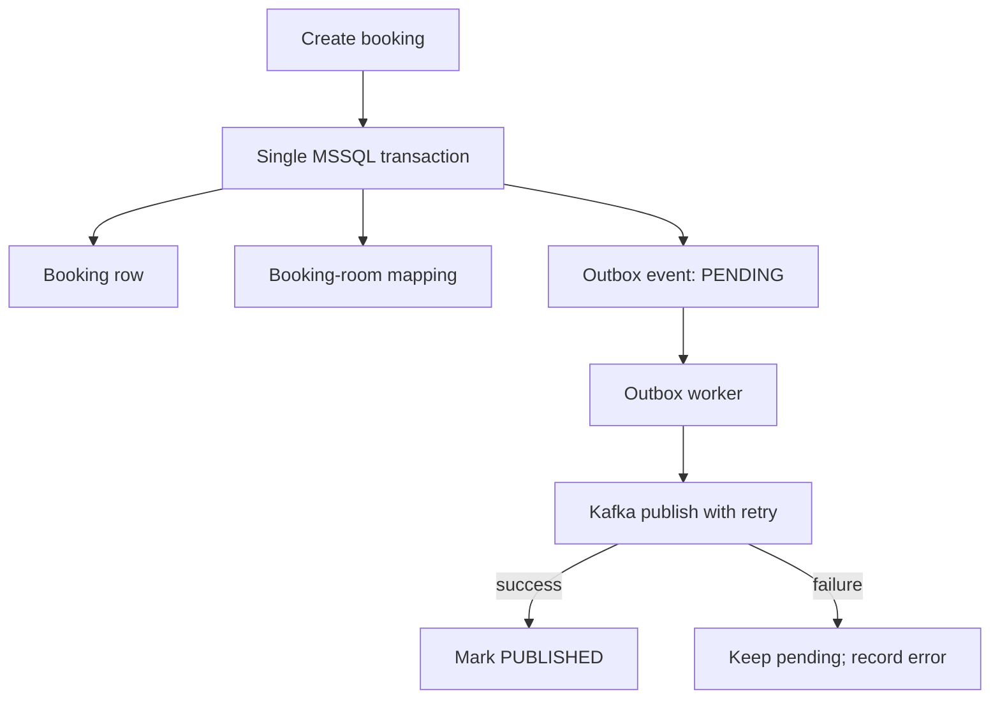
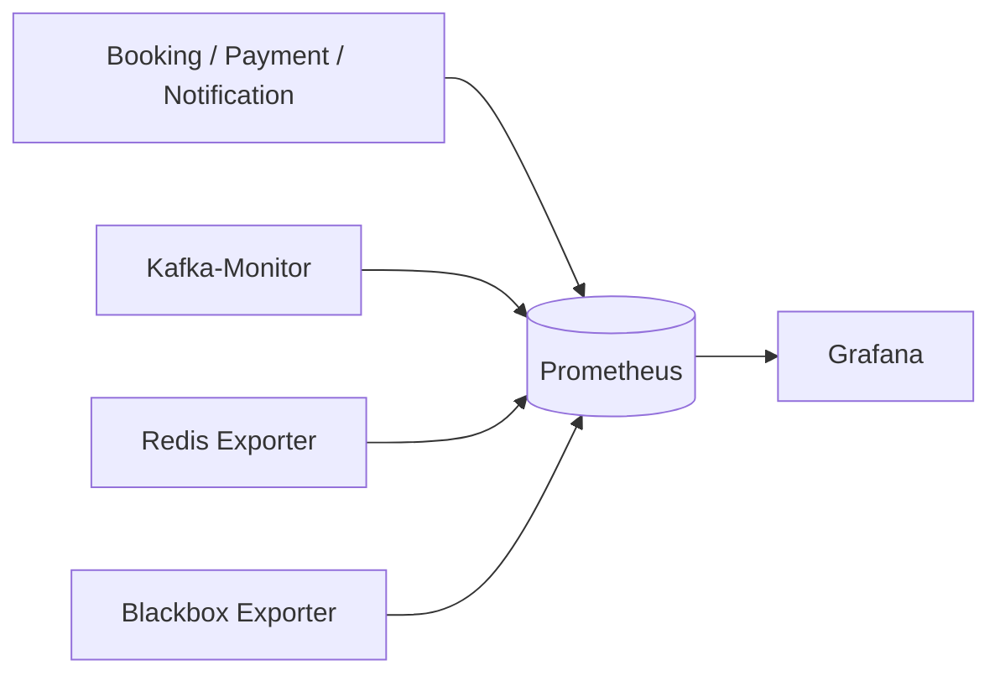
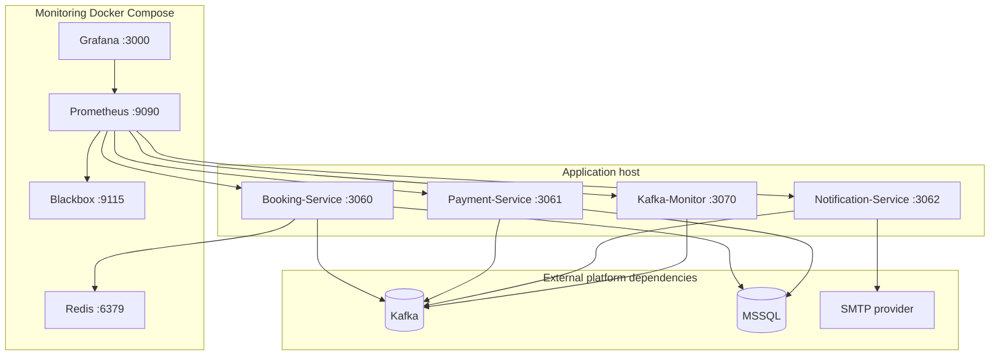
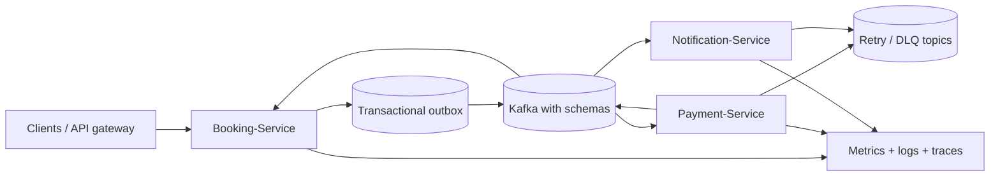

# Hostel Management System

## High-Level Design

| Field | Value |
|---|---|
| Document status | Current implementation and target architecture |
| Version | 1.0 |
| Date | 14 September 2026 |
| Audience | Engineering, QA, DevOps, Security, and product stakeholders |
| Primary repository | `Hostel-management` |

## 1. Executive Summary

The Hostel Management System is a TypeScript and Node.js microservice platform for managing users, roles, rooms, room types, bookings, wallet-backed payments, and payment notifications.

The system uses synchronous HTTP APIs for commands and queries and Apache Kafka for asynchronous business events. Booking creation is protected by a transactional outbox so a committed booking is not silently lost when Kafka is temporarily unavailable. Payment and notification processing are independently scalable Kafka consumers. Prometheus, Grafana, a Kafka lag monitor, Redis, and Blackbox Exporter provide the current operational foundation.

The current design is appropriate for a development or controlled pre-production environment. Before production scale, the priority improvements are consumer idempotency, atomic wallet debits, outbox row claiming, bounded retries with dead-letter topics, schema validation, and clear payment-data ownership.

## 2. Goals and Non-Goals

### Goals

- Provide secure APIs for identity, access control, room inventory, and booking operations.
- Accept a booking without making the client wait for payment and email processing.
- Ensure a committed booking produces a recoverable booking event.
- Process payment and notification independently from the booking API.
- Expose service, Kafka, cache, and business-flow telemetry.
- Support horizontal scaling of stateless HTTP services and Kafka consumers.

### Non-goals

- This document does not define UI or mobile-client design.
- This document does not prescribe a cloud provider or Kubernetes manifest.
- Kafka and MSSQL are treated as platform dependencies, not implemented by these services.
- Exactly-once processing is not claimed; the effective delivery model is at least once.

## 3. System Context



## 4. Component Overview

| Component | Responsibility | Current runtime |
|---|---|---|
| Booking-Service | Authentication, RBAC, users, roles, permissions, room types, rooms, bookings, outbox publication, payment-result consumption | Node.js/TypeScript, default port `3060` |
| Payment-Service | Wallet operations, payment processing, booking-event consumption, payment-result publication | Node.js/TypeScript, default port `3061` |
| Notification-Service | Payment-result consumption and success/failure email delivery | Node.js/TypeScript, default port `3062` |
| Kafka-Monitor | Consumer-lag collection for configured topic/group pairs | Node.js/TypeScript, default port `3070` |
| Kafka | Asynchronous event transport | Environment-defined broker endpoint |
| MSSQL | Relational system of record for booking and payment data | Environment-defined |
| Redis | Room-type cache | `6379` |
| Prometheus | Metrics scraping and storage | `9090` |
| Grafana | Dashboards and alert presentation | `3000` |
| Blackbox Exporter | Kafka TCP availability probe | `9115` |

## 5. Service Design

### 5.1 Booking-Service

The Booking-Service owns the user and booking journey. Its HTTP route groups are authentication, users, roles, room types, rooms, bookings, and payment-related queries. The internal path is:

```text
HTTP route -> controller -> service -> repository -> MSSQL
```

Cross-cutting capabilities include JWT authentication, bcrypt password hashing, role and permission middleware, input validation, rate limiting, logging, request metrics, Swagger/OpenAPI, Redis caching, Kafka integration, and the outbox worker.

### 5.2 Payment-Service

The Payment-Service consumes `booking.created`, validates payment details, checks the wallet, creates or updates a payment, and publishes `payment.result`. It also exposes wallet and payment HTTP endpoints.

Payment processing must be idempotent by `bookingId`. The current unique booking identifier migration reduces duplicate payments, but a complete production implementation must also make wallet deduction and payment-state transition atomic.

### 5.3 Notification-Service

The Notification-Service consumes `payment.result` using its own consumer group and sends success or failure email through SMTP. It is downstream of payment and does not authorize payment or directly change booking state.

### 5.4 Kafka-Monitor

Kafka-Monitor calculates lag for:

| Topic | Consumer group | Service label |
|---|---|---|
| `booking.created` | `payment-group` | `payment-service` |
| `payment.result` | `booking-group` | `booking-service` |
| `payment.result` | `notification-group` | `notification-service` |

## 6. Booking and Payment Flow



### Booking state model



The booking API intentionally returns before asynchronous payment completion. Clients must query the booking or receive a status update to observe the final state.

## 7. Event Architecture

### 7.1 Topic ownership



### 7.2 Event contracts

#### `booking.created`

Produced by Booking-Service. The event key is the booking ID.

```json
{
  "bookingId": 123,
  "userId": 45,
  "email": "guest@example.com",
  "amount": 250.0,
  "paymentMethod": "WALLET"
}
```

#### `payment.result`

Produced by Payment-Service. The event key is the booking ID.

```json
{
  "bookingId": 123,
  "userId": 45,
  "email": "guest@example.com",
  "paymentId": 789,
  "status": "SUCCESS"
}
```

Failure events include `status: "FAILED"` and a failure `reason`.

### 7.3 Delivery and consumer rules

- Producers use retry logic and the Booking-Service uses a transactional outbox.
- Consumers use independent groups so booking status and email delivery do not block each other.
- The effective delivery model is at least once.
- Every consumer must tolerate redelivery and use the booking ID as an idempotency key.
- Event payloads should gain an explicit schema version and validation before production use.

## 8. Transactional Outbox

Booking creation writes the booking, booking-room mapping, and `outbox_events` row in one MSSQL transaction. A worker polls pending rows, publishes to Kafka, and marks successful rows as published.



The outbox protects against losing the event after the booking transaction commits. The current implementation still needs row claiming or locking before multiple workers are used, because two workers can publish the same pending row concurrently. Failed rows also need bounded retries, backoff, alerting, and an operator-review or dead-letter state.

## 9. Data Architecture and Ownership

| Data domain | Current owner | Architectural decision |
|---|---|---|
| Users, roles, permissions | Booking-Service | Booking-Service owns identity and access control |
| Room types and rooms | Booking-Service | Booking-Service owns inventory |
| Bookings and room mappings | Booking-Service | Booking-Service owns booking lifecycle |
| Outbox events | Booking-Service | Booking-Service owns publication records |
| Wallets | Payment-Service | Payment-Service owns wallet operations |
| Payments | Shared/current implementation | Move payment schema ownership to Payment-Service or formalize a shared database contract |

### Redis cache

Booking-Service uses a cache-aside strategy for room types with a five-minute TTL. Current keys are `room-types:all` and `room-types:{roomTypeId}`. Cache errors fail open to MSSQL. Writes invalidate affected keys.

Redis is not the source of truth. Because room type price contributes to booking amount, authoritative pricing must be read or versioned within the booking transaction when price correctness is financially significant.

## 10. Security Architecture

### Current controls

- JWT authentication in Booking-Service.
- bcrypt password hashing.
- Role and permission middleware.
- Request validation on selected routes.
- Rate limiting in Booking-Service.
- Environment-based database and SMTP configuration where configured.
- Swagger/OpenAPI documentation.

### Required hardening

- Apply consistent authentication and authorization to Payment-Service wallet and payment routes.
- Move Kafka broker endpoints and all environment-specific addresses to configuration.
- Use TLS/SASL for Kafka outside a trusted isolated network.
- Store secrets in a secret manager or protected deployment environment.
- Minimize personal data in event payloads, especially email addresses.
- Add audit events for wallet debits, payment transitions, role changes, and booking cancellation.
- Redact credentials, tokens, wallet balances, and sensitive payment details from logs.

## 11. Reliability, Scaling, and Failure Handling

| Failure | Current behavior | Required production behavior |
|---|---|---|
| Kafka unavailable during booking | Booking commits and outbox remains pending | Alert on oldest pending event age |
| Duplicate Kafka delivery | Possible on retry or restart | Idempotent payment and status consumers |
| Wallet debit failure | Payment failure result is published | Atomic conditional debit and state transition |
| Malformed event | Handler records failure or returns | Validate schema and route poison messages to a DLQ |
| SMTP failure | Notification processing fails | Retry transient errors and park permanent failures |
| Redis unavailable | Cache miss path uses database | Maintain availability and alert on cache errors |
| Database unavailable | Requests or startup fail | Readiness checks, bounded retries, and alerts |
| Multiple outbox workers | Duplicate publication is possible | Claim rows with lock or lease before publishing |

Horizontal consumer scaling is supported through Kafka consumer groups. Topic partition count must be sufficient for the desired parallelism. `bookingId` should remain the message key to preserve per-booking ordering within a partition.

## 12. Observability and Operations



### Current telemetry

- HTTP request count and duration.
- Kafka messages produced, consumed, and failed.
- Consumer lag by topic, group, partition, and service.
- Kafka TCP availability.
- Redis exporter metrics.

### Required dashboards and alerts

1. Service availability, HTTP error rate, and p95 latency.
2. Kafka broker availability, consumer lag, and failure rate.
3. Booking counts by `PENDING`, `CONFIRMED`, `PAYMENT_FAILED`, and `CANCELLED`.
4. Payment failures, duplicate attempts, and publish failures.
5. Outbox depth, oldest pending age, attempts, and last error.
6. Notification success, failure, and processing latency.
7. Redis availability, hit/miss ratio, and cache error rate.

Prometheus currently scrapes Node services through `host.docker.internal`. The monitoring Compose stack starts Redis, exporters, Prometheus, and Grafana; Kafka and the Node services are external to that Compose file.

## 13. Deployment View



Readiness should be separated from liveness. A service can be alive while its database, Kafka, Redis, or SMTP dependency is unavailable; readiness should represent whether it can safely accept the relevant workload.

## 14. Non-Functional Requirements

| Area | Requirement |
|---|---|
| Availability | Booking creation must preserve committed bookings during temporary Kafka outages through the outbox |
| Consistency | Booking status must be driven by payment result; wallet debit and payment state must be atomic |
| Performance | Track API latency, Kafka processing duration, database latency, and pending-event age |
| Scalability | Scale HTTP instances independently; scale consumers with Kafka partitions |
| Security | Protect authenticated operations, secure transport, and keep secrets out of source control |
| Recoverability | Retry transient failures, bound retries, and preserve failed events for operator action |
| Operability | Provide health, readiness, metrics, logs, dashboards, and actionable alerts |
| Auditability | Record business-significant payment, wallet, access-control, and cancellation transitions |

## 15. Target Evolution Roadmap

### Priority 0: before production approval

1. Remove or feature-flag any forced Payment consumer test failure.
2. Make wallet debit and payment transition atomic.
3. Make payment and booking-result consumers idempotent.
4. Add outbox row claim or lease semantics.
5. Add retry limits and DLQ or parking-lot topics.
6. Clarify payment database ownership.

### Priority 1: production hardening

1. Add versioned event schemas and validation.
2. Move all broker and service addresses to configuration.
3. Add readiness endpoints and alert rules.
4. Add outbox, payment, notification, and cache metrics.
5. Secure Payment-Service routes with authentication and authorization.
6. Add structured audit logging and sensitive-data redaction.

### Target shape



## 16. Architecture Decisions and Open Questions

| Decision / question | Current position | Owner / next action |
|---|---|---|
| Payment schema ownership | Shared migration footprint | Assign ownership to Payment-Service or publish a formal shared contract |
| Event versioning | Not explicit | Add `eventType` and `eventVersion` to every event |
| Poison-message handling | Redelivery can continue indefinitely | Define retry count, DLQ topic, and replay procedure |
| Pricing authority | Room type cache can be stale until TTL | Read authoritative price in booking transaction or use price versioning |
| Deployment platform | Local services plus monitoring Compose | Select production runtime and define network/security controls |
| Data retention | Not defined | Set retention for outbox, payment audit, logs, and Kafka topics |

## 17. Repository Source Map

| Concern | Source |
|---|---|
| Booking application and routes | `Booking-Service/src/app.ts` |
| Booking orchestration | `Booking-Service/src/services/booking.service.ts` |
| Outbox worker and publisher | `Booking-Service/src/outbox/` |
| Kafka topics and consumers | `Booking-Service/src/kafka/`, `Payment-Service/src/kafka/` |
| Payment and wallet services | `Payment-Service/src/services/` |
| Notification consumer | `Notification-Service/src/kafka/consumer.ts` |
| Redis cache | `Booking-Service/src/services/cache.service.ts` |
| Kafka lag monitor | `Kafka-Monitor/src/kafka/consumerLag.ts` |
| Prometheus configuration | `Monitoring/prometheus/prometheus.yml` |
| Monitoring stack | `Monitoring/docker-compose.yml` |

## 18. Confluence Publishing Notes

1. Upload or paste this Markdown into the Confluence page using the team Markdown import method or a Markdown macro.
2. Preserve the Mermaid blocks if the Confluence Mermaid macro is enabled; otherwise export the diagrams from the HTML document as images.
3. Set the page status to **Draft** until the open questions and Priority 0 controls have owners and due dates.
4. Add page labels such as `architecture`, `hostel-management`, `microservices`, `kafka`, and `hld`.
5. Link the page to the service repositories and the operational runbook.