# Hostel Management System
## High-Level Design

**Document status:** Current implementation review  
**Date:** 2026-09-10  
**Scope:** Booking, Payment, Notification, Kafka monitoring, Redis caching, and operational monitoring

## 1. Purpose and Scope

The Hostel Management System is a TypeScript/Node.js microservice system for:

- User authentication, roles, and permissions
- Room type and room inventory management
- Booking creation and cancellation
- Wallet-backed payment processing
- Payment result notifications by email
- Kafka-based asynchronous service integration
- Prometheus/Grafana operational monitoring
- Redis caching for room-type reads

This document describes the architecture currently present in the repository. It also identifies important reliability boundaries and implementation decisions that should be addressed before production use.

## 2. System Context

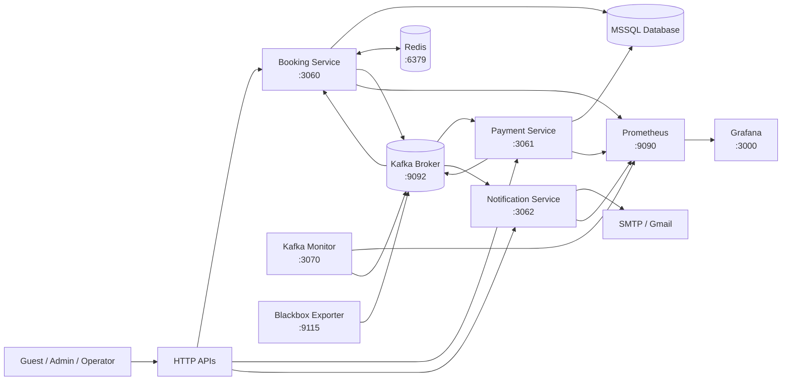

### Runtime components

| Component | Responsibility | Default endpoint |
|---|---|---|
| Booking-Service | Identity, RBAC, rooms, room types, bookings, outbox publisher, payment-result consumer | `3060` |
| Payment-Service | Wallet and payment APIs, booking-event consumer, payment-result producer | `3061` |
| Notification-Service | Payment-result consumer and email delivery | `3062` |
| Kafka-Monitor | Consumer lag collection for configured topic/group pairs | `3070` |
| Kafka | Asynchronous event transport | `172.23.74.113:9092` |
| MSSQL | Relational persistence for booking and payment data | Environment-defined |
| Redis | Room-type cache | `6379` |
| Prometheus | Metrics scraping and time-series storage | `9090` |
| Grafana | Dashboards and visualization | `3000` |
| Blackbox Exporter | Kafka TCP availability probe | `9115` |

The monitoring Docker Compose file starts Redis, Prometheus, Grafana, and Blackbox Exporter. Kafka and the Node.js services are expected to run outside that Compose file and are reached through `host.docker.internal` by Prometheus.

## 3. Service Boundaries

### 3.1 Booking-Service

**HTTP responsibilities**

- Authentication: `/auth`
- User management: `/users`
- Roles and permissions: `/roles`
- Room types: `/room-types`
- Rooms: `/rooms`
- Bookings: `/bookings`
- Local payment-related endpoints: `/payments`
- OpenAPI documentation: `/api-docs`
- Metrics: `/metrics`

**Internal layers**

```text
HTTP route
  -> controller
  -> service
  -> repository
  -> MSSQL
```

Cross-cutting concerns include JWT authentication, bcrypt password hashing, role/permission middleware, validation, rate limiting, logging, request metrics, Swagger, Redis, Kafka, and the outbox worker.

### 3.2 Payment-Service

**HTTP responsibilities**

- Wallet operations: `/wallet`
- Payment queries and administrative operations: `/payments`
- Health, metrics, and Swagger endpoints

**Kafka responsibilities**

- Consumes `booking.created` as consumer group `payment-group`
- Processes wallet-backed payment
- Produces `payment.result`

**Payment processing sequence**

1. Parse the booking event.
2. Check whether a payment already exists for the booking.
3. Validate payment method and amount.
4. Load the wallet and validate balance.
5. Create a pending payment.
6. Deduct wallet balance.
7. Mark the payment successful.
8. Publish a successful `payment.result`.
9. On a processing failure, publish a failed `payment.result`.

### 3.3 Notification-Service

**HTTP responsibilities**

- Health endpoint
- Metrics endpoint
- Swagger endpoint

**Kafka responsibilities**

- Consumes `payment.result` as consumer group `notification-group`
- Sends success or failure email through Nodemailer/SMTP

Notification is intentionally downstream of payment. It does not participate in payment authorization or booking status changes.

### 3.4 Kafka-Monitor

Kafka-Monitor uses a Kafka admin client to calculate lag for these pairs:

| Topic | Consumer group | Service label |
|---|---|---|
| `booking.created` | `payment-group` | `payment-service` |
| `payment.result` | `booking-group` | `booking-service` |
| `payment.result` | `notification-group` | `notification-service` |

The monitor exposes the lag as Prometheus metrics and refreshes it approximately every five seconds.

## 4. Primary Booking and Payment Flow

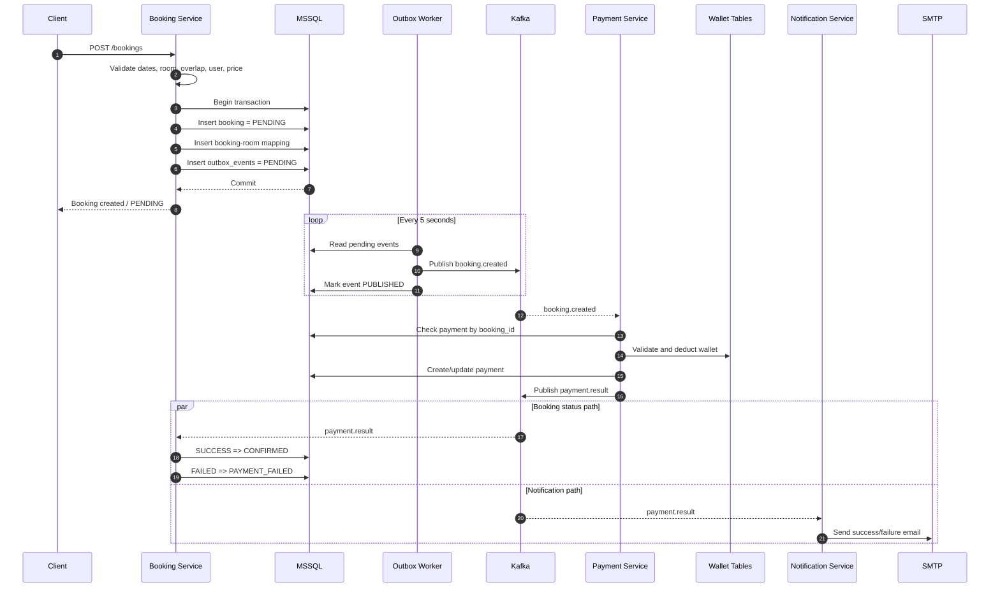

### Booking state transition

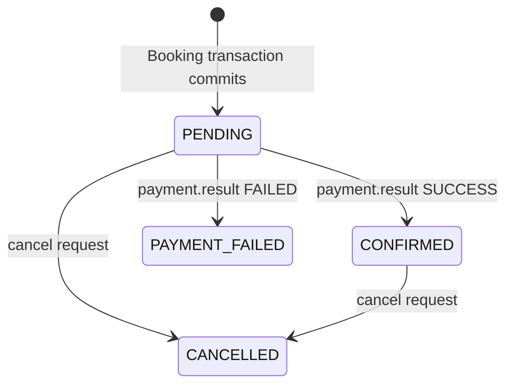

The booking API does not wait synchronously for payment completion. `PENDING` is the expected intermediate state.

## 5. Kafka Design

### 5.1 Topic ownership and contracts

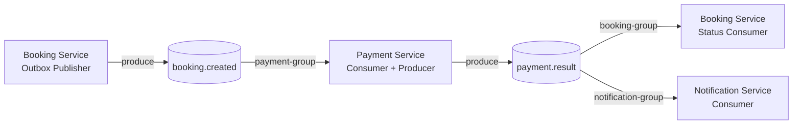

#### `booking.created`

Produced by the Booking outbox publisher. The current payload contains:

```json
{
  "bookingId": 123,
  "userId": 45,
  "email": "guest@example.com",
  "amount": 250.0,
  "paymentMethod": "WALLET"
}
```

The event key is the booking ID.

#### `payment.result`

Produced by Payment-Service. A success payload contains payment ID and status; a failure payload contains status and reason.

```json
{
  "bookingId": 123,
  "userId": 45,
  "email": "guest@example.com",
  "paymentId": 789,
  "status": "SUCCESS"
}
```

```json
{
  "bookingId": 123,
  "userId": 45,
  "email": "guest@example.com",
  "status": "FAILED",
  "reason": "Insufficient Balance"
}
```

### 5.2 Consumer behavior

Consumers use KafkaJS `eachMessage`. Successful processing increments `kafka_messages_consumed_total`. Processing failures increment `kafka_messages_failed_total` and are rethrown so the source event remains eligible for Kafka redelivery.

The Payment consumer has a deliberate test failure statement in the current source. It must be removed or feature-flagged before a normal presentation or demo run.

### 5.3 Delivery model

The effective business delivery model is **at least once**:

- Producers use retry logic.
- Booking uses a transactional outbox.
- Consumers can receive a message again after failure or restart.
- Payment has a unique booking ID migration to reduce duplicate payments.

This is not end-to-end exactly-once processing. Database writes and Kafka publication are not one distributed transaction.

## 6. Outbox Design

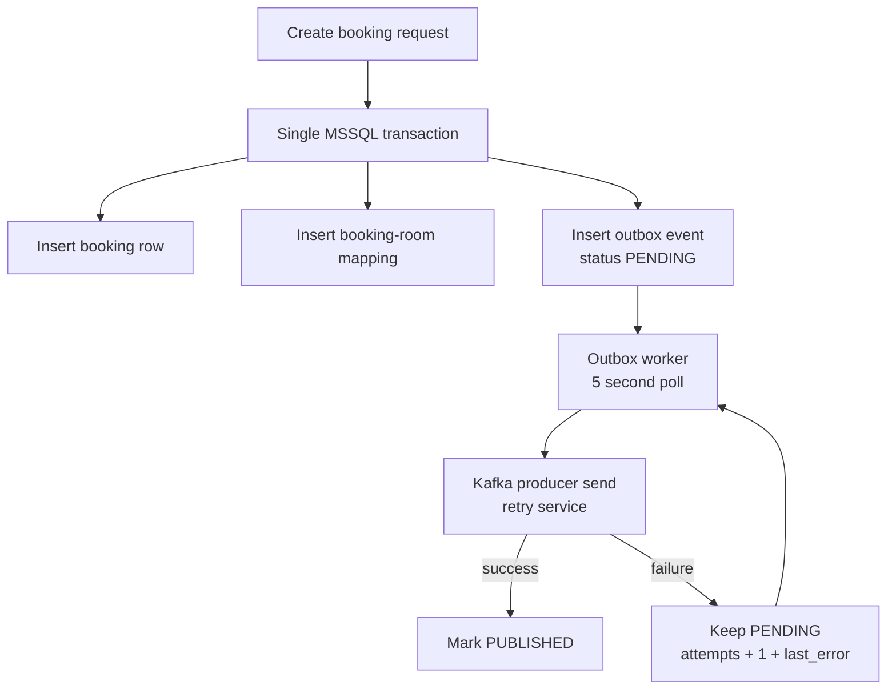

### Outbox record

The `outbox_events` table stores:

- `event_id`
- `event_type`
- `aggregate_id`
- `payload`
- `status`
- `attempts`
- `created_at`
- `published_at`
- `last_error`

### Reliability characteristics

**Benefit:** A successful booking transaction cannot lose its event merely because Kafka is unavailable at that instant.

**Current limitation:** Pending rows are read without an explicit claim/lock. Multiple Booking-Service instances can publish the same event concurrently. Consumers therefore need idempotent processing, and an outbox claim mechanism should be added for horizontal scaling.

**Current limitation:** Failed rows remain pending indefinitely. A production design should add maximum attempts, exponential backoff, alerting, and a dead-letter or operator-review state.

## 7. Retry and Exception Handling

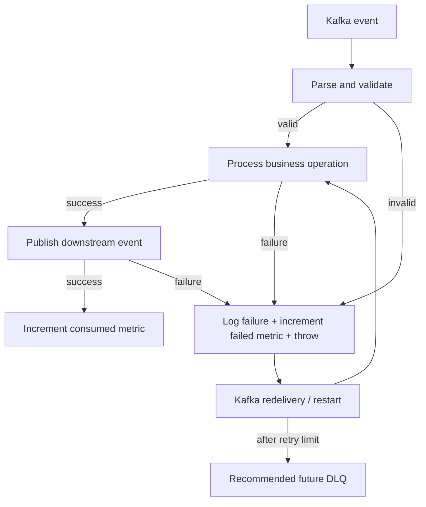

### Retry layers

| Layer | Current behavior | Purpose |
|---|---|---|
| Kafka producer | Five attempts with a fixed five-second delay | Recover transient broker/network failures |
| Outbox worker | Poll pending events every five seconds | Retry publication after service/Kafka recovery |
| Consumer | Rethrow handler failures | Prevent successful acknowledgement of failed processing |
| Kafka broker | Redelivery according to consumer offset behavior | Recover after restart or failed handler |

### Required production decisions

- Add schema validation before business processing.
- Define retryable versus non-retryable exceptions.
- Add a retry limit and DLQ/parking-lot topic for poison messages.
- Add idempotency keys or processed-event records.
- Use exponential backoff with jitter for broker and downstream retries.
- Avoid logging sensitive payment or credential data.

## 8. Data Architecture

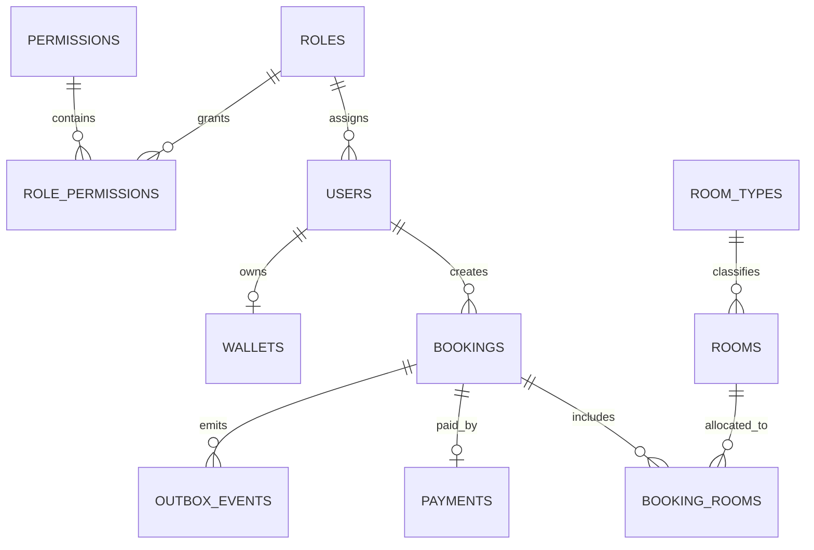

### Logical data ownership

| Data set | Main owner in current code | Notes |
|---|---|---|
| Users, roles, permissions | Booking-Service | JWT authentication and RBAC |
| Room types and rooms | Booking-Service | Room-type reads use Redis cache |
| Bookings and room mappings | Booking-Service | Booking creation uses MSSQL transaction |
| Outbox events | Booking-Service | Drives `booking.created` publication |
| Wallets | Payment-Service | Wallet APIs and balance operations |
| Payments | Shared/current implementation | Payment table is created in Booking migrations but read by Payment-Service |

The payment table placement is a design boundary that should be clarified. A cleaner ownership model is for Payment-Service to own payment schema and Payment-Service migrations, or for both services to explicitly share one database contract.

## 9. Redis Cache Design

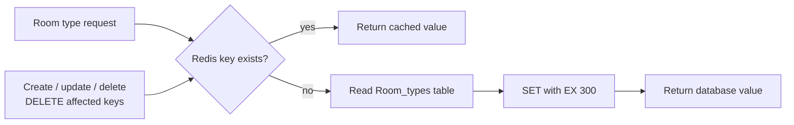

### Keys

- `room-types:all`
- `room-types:{roomTypeId}`

### Behavior

- Cache-aside reads
- Five-minute TTL
- Cache errors are logged and treated as misses
- Create invalidates the collection key
- Update/delete invalidate both the individual key and collection key

### Consistency note

Redis is an optimization, not the system of record. A failed invalidation can leave stale room type data until TTL expiry. This matters because room type price is used when calculating a booking amount. If price freshness is financially authoritative, booking creation should read the authoritative price within the booking transaction or use a versioned pricing model.

## 10. Observability and Operations

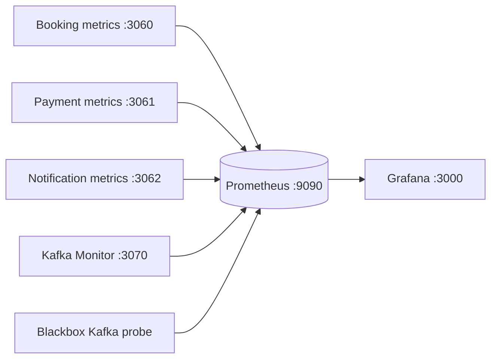

### Metrics currently exposed

- HTTP request count
- HTTP request duration
- Kafka messages produced
- Kafka messages consumed
- Kafka message failures
- Consumer lag by topic, consumer group, partition, and service
- Kafka TCP availability through Blackbox Exporter

### Recommended dashboards

1. **Service health:** process availability, HTTP error rate, p95 latency.
2. **Kafka overview:** broker probe, consumer lag, produced/consumed/failed rates.
3. **Booking journey:** bookings created, pending duration, confirmed, payment failed.
4. **Payment reliability:** wallet/payment failures, duplicate payment attempts, publish failures.
5. **Outbox:** pending count, oldest pending age, attempts, last error.
6. **Notification:** email success/failure, processing latency, retry count.
7. **Cache:** Redis availability, hit/miss count, cache operation errors.

### Monitoring caveats

- Prometheus scrapes application services through `host.docker.internal`.
- The Compose stack does not start Kafka or the Node services.
- The Kafka monitor reconnects its admin client during each polling cycle; overlapping slow polls should be prevented.
- Alert rules and dashboard definitions are not part of the current monitoring files shown in the repository.

## 11. Security Design

### Implemented controls

- JWT-based authentication in Booking-Service
- bcrypt password hashing
- Role and permission middleware
- Request validation in selected routes
- Rate limiting in Booking-Service
- Environment-based database and email configuration where configured
- Swagger/OpenAPI documentation

### Security gaps to address

- Payment and wallet HTTP routes currently need consistent authentication and authorization middleware.
- Kafka broker configuration should be environment-driven rather than hardcoded.
- Kafka transport should use TLS/SASL in environments where the broker is not isolated.
- Secrets should be managed through a secret store or deployment environment, not committed `.env` files.
- Event payloads should avoid unnecessary personal data such as email if consumers can resolve it securely.
- Add audit logging for wallet debits, payment state changes, role changes, and booking cancellation.

## 12. Deployment View

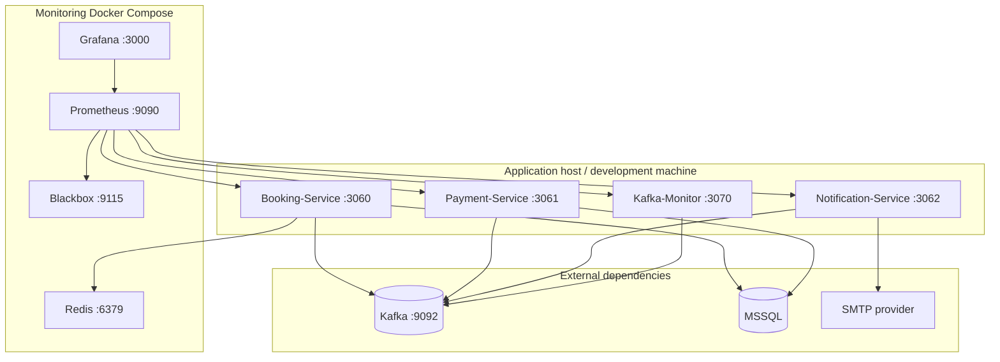

### Startup dependencies

- Booking-Service checks MSSQL, connects its Kafka producer and consumer, starts the outbox worker, then connects Redis.
- Payment-Service checks MSSQL, connects Kafka producer and consumer, then starts HTTP.
- Notification-Service connects Kafka consumer before starting HTTP.
- Kafka-Monitor starts its lag collection and HTTP endpoint.

For production, startup readiness should be separated from liveness. A service should expose whether it can serve traffic and whether its database, Kafka, Redis, and SMTP dependencies are ready.

## 13. Failure Scenarios

| Failure | Current behavior | Desired operational response |
|---|---|---|
| Kafka unavailable during booking | Booking and outbox row commit; worker retries publication | Alert on oldest pending outbox age |
| Payment processing fails | Payment attempts failed result publication | Ensure failed result publication cannot be silently lost |
| Payment result publish fails | Source event remains recoverable when error is thrown | Use idempotent payment processing before redelivery |
| Notification email fails | Consumer error is rethrown in current implementation | Retry transient SMTP failures; DLQ permanent failures |
| Malformed Kafka payload | Handler fails and event can redeliver | Validate schema and route poison messages to DLQ |
| Redis unavailable | Cache operations fail open to database | Keep service available; alert on cache error rate |
| Duplicate outbox publication | Possible with multiple workers/no row claim | Add row locking/claim lease and consumer idempotency |
| Database unavailable | API/startup operations fail | Use readiness checks, retry policy, and alerts |

## 14. Capacity and Scaling Model

### Horizontal scaling

- Booking-Service can scale HTTP instances, but the outbox worker needs row claiming/locking to avoid duplicate publication.
- Payment-Service instances can share `payment-group`; Kafka partitions determine parallelism.
- Booking-Service payment-result consumers can share `booking-group`.
- Notification-Service instances can share `notification-group`.
- To scale a consumer horizontally, the topic must have enough partitions.

### Ordering

Use `bookingId` as the Kafka message key for booking-related events. This preserves ordering for records with the same booking key within a partition.

### Backpressure

Consumer lag is the primary current backpressure signal. Production operation should also track outbox depth, event age, processing duration, and downstream SMTP/database latency.

## 15. Current Risks and Decisions

### High priority

1. Remove or feature-flag the forced Payment consumer test exception.
2. Add idempotent payment processing around duplicate Kafka delivery and consumer restarts.
3. Make wallet debit and payment state transition atomic, ideally inside a database transaction with conditional balance update.
4. Add outbox row claiming/locking before running multiple Booking-Service instances.
5. Add a retry limit and DLQ/parking-lot path for poison events.
6. Clarify ownership of the payment table and payment APIs.

### Medium priority

1. Add event schema validation and a version field.
2. Move Kafka broker addresses and all environment-specific endpoints to configuration.
3. Add outbox and cache metrics.
4. Add readiness endpoints and alert rules.
5. Protect Payment-Service wallet/payment routes with authentication and authorization.
6. Prevent overlapping Kafka monitor polling cycles.

## 16. Recommended Target Evolution

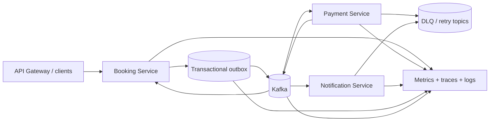

The target design keeps the current event-driven shape while adding the controls needed for production: durable event contracts, deduplication, bounded retries, DLQs, outbox ownership, secure service boundaries, and end-to-end observability.

## 17. Source Map

- Booking application and route registration: `Booking-Service/src/app.ts`
- Booking orchestration and outbox transaction: `Booking-Service/src/services/booking.service.ts`
- Outbox worker: `Booking-Service/src/outbox/outbox.worker.ts`
- Outbox publisher: `Booking-Service/src/outbox/outbox.publisher.ts`
- Booking Kafka producer/consumer: `Booking-Service/src/kafka/producer.ts`, `Booking-Service/src/kafka/consumer.ts`
- Payment application and Kafka consumer: `Payment-Service/src/app.ts`, `Payment-Service/src/kafka/consumer.ts`
- Payment and wallet services: `Payment-Service/src/services/Payment.services.ts`, `Payment-Service/src/services/Wallet.services.ts`
- Notification consumer: `Notification-Service/src/kafka/consumer.ts`
- Redis cache wrapper: `Booking-Service/src/services/cache.service.ts`
- Room-type cache service: `Booking-Service/src/services/roomTypes.services.ts`
- Kafka lag monitor: `Kafka-Monitor/src/kafka/consumerLag.ts`
- Prometheus configuration: `Monitoring/prometheus/prometheus.yml`
- Monitoring Compose stack: `Monitoring/docker-compose.yml`
