# Project Structure Graph

This file shows the current folder and file layout for the Payment Service project.

## Mermaid Diagram

```mermaid
graph TD
    root["Payment-Service"] --> pkg["package.json"]
    root --> tsconfig["tsconfig.json"]
    root --> knex["knexfile.ts"]
    root --> nodemon["nodemon.json"]
    root --> gitignore[".gitignore"]
    root --> env[".env"]
    root --> database["database/"]
    database --> migrations["migrations/"]
    database --> seeds["seeds/"]
    root --> src["src/"]
    src --> app["app.ts"]
    src --> config["config/"]
    config --> db["db.ts"]
    config --> swagger["swagger.ts"]
    src --> controllers["controllers/"]
    controllers --> paymentController["Payment.controllers.ts"]
    controllers --> walletController["Wallet.controllers.ts"]
    src --> logger["logger/"]
    logger --> loggerService["logger.service.ts"]
    src --> middlewares["middlewares/"]
    middlewares --> validateMiddleware["validate.middlewares.ts"]
    src --> repositories["repositories/"]
    repositories --> paymentRepo["PaymentRepository.ts"]
    repositories --> walletRepo["WalletRepository.ts"]
    src --> routes["routes/"]
    routes --> paymentRoutes["payment.routes.ts"]
    routes --> walletRoutes["wallet.routes.ts"]
    src --> services["services/"]
    services --> paymentService["Payment.services.ts"]
    services --> walletService["Wallet.services.ts"]
    src --> types["types/"]
    types --> swaggerTypes["swagger-jsdoc.d.ts"]
```



## ASCII Tree

```text
Payment-Service/
├── .env
├── .gitignore
├── database/
│   ├── migrations/
│   └── seeds/
├── knexfile.ts
├── nodemon.json
├── package.json
├── tsconfig.json
└── src/
    ├── app.ts
    ├── config/
    │   ├── db.ts
    │   └── swagger.ts
    ├── controllers/
    │   ├── Payment.controllers.ts
    │   └── Wallet.controllers.ts
    ├── logger/
    │   └── logger.service.ts
    ├── middlewares/
    │   └── validate.middlewares.ts
    ├── repositories/
    │   ├── PaymentRepository.ts
    │   └── WalletRepository.ts
    ├── routes/
    │   ├── payment.routes.ts
    │   └── wallet.routes.ts
    ├── services/
    │   ├── Payment.services.ts
    │   └── Wallet.services.ts
    └── types/
        └── swagger-jsdoc.d.ts
```
